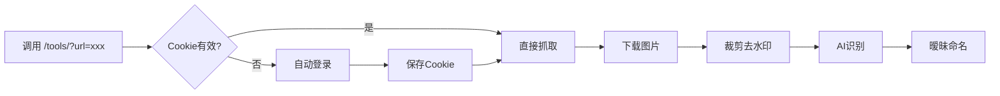

# 小红书API快速使用指南

## 🚀 最简单的使用方法

### 智能批量抓取（推荐）⭐⭐⭐
直接调用批量接口，一次处理多个链接：
```http
# 单个URL
GET http://127.0.0.1:8000/tools/getImgViaPlaywright?urls=你的小红书链接

# 批量处理（推荐）
GET http://127.0.0.1:8000/tools/getImgViaPlaywright?urls=链接1,链接2,链接3
```

**特点：**
- ✅ 支持单个或批量处理（用逗号分隔）
- ✅ 自动检查Cookie有效性
- ✅ Cookie过期自动重新登录
- ✅ 15分钟内所有请求复用同一Cookie
- ✅ 无需手动管理任何状态
- ✅ 详细的处理结果反馈

---

## 📋 完整功能列表

| 接口 | 功能 | 使用场景 |
|------|------|----------|
| `/tools/getImgViaPlaywright` | **智能批量接口** - 支持单个/批量处理 | 日常使用（推荐）⭐ |
| `/tools/cookieStatus` | 检查Cookie状态 | 查看剩余有效时间 |
| `/tools/playwrightLogin` | 手动登录 | 强制刷新Cookie |
| `/tools/` | 单URL自动管理接口 | 单个URL处理 |
| `/tools/processManualDownload` | 处理手动下载 | 备用方案 |

---

## 🔄 工作流程

### 方案A：全自动（推荐）


### 方案B：手动控制
1. 检查状态：`GET /tools/cookieStatus`
2. 如需登录：`GET /tools/playwrightLogin`
3. 批量抓取：`GET /tools/?url=xxx`

---

## ⏰ Cookie管理机制

- **有效期**：15分钟
- **存储位置**：
  - 内存缓存（快速访问）
  - 文件持久化（`xiaohongshu_cookies.json`）
- **自动刷新**：过期后自动重新登录

---

## 💡 使用技巧

### 1. 批量处理
在15分钟内完成所有请求，避免重复登录：
```python
# 伪代码示例
urls = ["url1", "url2", "url3"]
for url in urls:
    response = requests.get(f"http://127.0.0.1:8000/tools/?url={url}")
    print(response.json())
```

### 2. 状态监控
定期检查Cookie状态，提前刷新：
```http
GET http://127.0.0.1:8000/tools/cookieStatus
```
当 `remaining_minutes < 2` 时，考虑刷新。

### 3. 强制刷新
遇到问题时强制重新登录：
```http
GET http://127.0.0.1:8000/tools/playwrightLogin?force=true
```

---

## 🔧 故障排查

| 问题 | 解决方案 |
|------|----------|
| "Not Found"错误 | 检查URL格式，确保包含完整的小红书链接 |
| Cookie过期频繁 | 检查系统时间是否正确 |
| 登录失败 | 删除`xiaohongshu_cookies.json`后重试 |
| 图片下载失败 | 检查网络连接和账号状态 |

---

## 📊 响应格式

### 成功响应
```json
{
  "status": "success",
  "message": "图片处理成功: https://...",
  "cookie_status": "valid"  // 或 "refreshed"
}
```

### Cookie状态
```json
{
  "status": "valid",
  "message": "Cookies有效，剩余14.5分钟",
  "data": {
    "cookies_count": 12,
    "remaining_minutes": 14.5,
    "expires_at": "2024-12-25T10:30:00"
  }
}
```

### 错误响应
```json
{
  "status": "error",
  "message": "错误描述",
  "hint": "解决建议"
}
```

---

## 📝 完整示例

### Python调用示例
```python
import requests

# 1. 批量处理（推荐）
def batch_fetch_xiaohongshu(urls):
    """
    批量处理小红书链接
    :param urls: 链接列表或用逗号分隔的字符串
    """
    if isinstance(urls, list):
        urls_str = ",".join(urls)
    else:
        urls_str = urls
    
    response = requests.get(
        "http://127.0.0.1:8000/tools/getImgViaPlaywright",
        params={"urls": urls_str}
    )
    return response.json()

# 2. 单个URL处理
def single_fetch_xiaohongshu(url):
    response = requests.get(
        "http://127.0.0.1:8000/tools/getImgViaPlaywright", 
        params={"urls": url}
    )
    return response.json()

# 3. 检查Cookie状态
def check_cookie_status():
    response = requests.get("http://127.0.0.1:8000/tools/cookieStatus")
    return response.json()

# 4. 使用示例
if __name__ == "__main__":
    # 批量处理示例
    urls = [
        "https://www.xiaohongshu.com/explore/url1",
        "https://www.xiaohongshu.com/explore/url2", 
        "https://www.xiaohongshu.com/explore/url3"
    ]
    
    result = batch_fetch_xiaohongshu(urls)
    print(f"批量处理结果: {result['message']}")
    print(f"成功: {result['summary']['success_count']}")
    print(f"失败: {result['summary']['error_count']}")
```

### Shell脚本示例
```bash
#!/bin/bash

# 检查Cookie状态
echo "检查Cookie状态..."
curl -s "http://127.0.0.1:8000/tools/cookieStatus" | jq

# 单个URL抓取
echo "单个URL处理..."
URL="https://www.xiaohongshu.com/explore/xxx"
curl -s "http://127.0.0.1:8000/tools/getImgViaPlaywright?urls=$URL" | jq

# 批量处理多个URL
echo "批量处理多个URL..."
URLS="https://www.xiaohongshu.com/explore/url1,https://www.xiaohongshu.com/explore/url2,https://www.xiaohongshu.com/explore/url3"
curl -s "http://127.0.0.1:8000/tools/getImgViaPlaywright?urls=$URLS" | jq

# 强制重新登录
echo "强制重新登录..."
curl -s "http://127.0.0.1:8000/tools/playwrightLogin?force=true" | jq
```

---

## 📚 更多信息

详细的API文档和高级用法请查看：
- `xiaohongshu_api.http` - 完整的HTTP测试文档
- `tools/image_tools.py` - 源代码实现

---

## 🎯 总结

**最简单高效的使用方法：**

### 单个URL：
```
GET http://127.0.0.1:8000/tools/getImgViaPlaywright?urls=你的小红书链接
```

### 批量处理（推荐）：
```
GET http://127.0.0.1:8000/tools/getImgViaPlaywright?urls=链接1,链接2,链接3
```

**系统会自动处理所有细节：**
- ✅ 智能Cookie管理（15分钟复用）
- ✅ 自动登录和重试
- ✅ 批量下载和去水印
- ✅ AI识别和暧昧文件夹命名
- ✅ 详细的处理结果反馈

**一次登录，批量处理，高效便捷！**